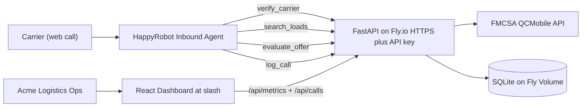

# HappyRobot FDE Take-Home — Inbound Carrier Sales

A working proof-of-concept for an inbound voice agent that vets carriers, matches them
to loads, and negotiates pricing — wrapped in a custom metrics dashboard that a freight
broker would actually want to use.

- **Voice agent:** built on HappyRobot (web-call trigger).
- **Backend:** FastAPI + SQLModel + SQLite, deployed as a single container.
- **Dashboard:** React + Vite + Recharts, served by the same FastAPI process.
- **Infra:** one Docker image, deployed to Fly.io with auto-TLS and a persistent volume.

## Live links

- Dashboard: `https://happyrobot-fde-tb.fly.dev/`
- API docs (OpenAPI/Swagger): `https://happyrobot-fde-tb.fly.dev/api/docs`
- Health: `https://happyrobot-fde-tb.fly.dev/healthz`

## Architecture



## Repo layout

```
backend/                  FastAPI service
  app/
    main.py               app factory, middleware, static SPA serving
    core/                 settings, auth, db, logging, rate limiter
    api/                  verify, loads, negotiate, calls, metrics
    services/             fmcsa client, negotiation policy, load search, seeder
    models/               SQLModel tables (Load, Call)
    seeds/loads.csv       20 demo loads
  tests/                  pytest (negotiation policy + API smoke)
  pyproject.toml
frontend/                 React + Vite dashboard
  src/
    App.tsx               KPI row, charts, calls table, drawer
    components/           KpiCard, Charts (Recharts), CallDrawer
    lib/api.ts            typed fetch client
docs/
  build_doc.md            "Acme Logistics" build narrative
  email.md                Pre-meeting email to Carlos Becker
  happyrobot_workflow.md  Workflow setup spec (prompts, tools, classifiers)
  runbook.md              Operations / reproduce-in-10-minutes
Dockerfile                multi-stage (Vite build -> Python 3.12 runtime)
fly.toml                  Fly.io app config
docker-compose.yml        local container run
Makefile                  one-line tasks
```

## Quickstart (local dev)

```bash
make setup         # creates backend/.venv (Python 3.12 via uv) + frontend node_modules
make test          # 18 backend tests
export API_KEY=local-dev-key
export FMCSA_API_KEY=<your-fmcsa-key>
make dev-api &     # backend on :8000 (serves /api/* + /healthz)
make dev-web       # frontend on :5173, proxies /api/* -> :8000
```

## API surface (all behind `X-API-Key`)

| Method & path | Purpose |
|---|---|
| `GET  /healthz` | Liveness (public) |
| `POST /api/verify_carrier` | FMCSA carrier eligibility check (cached 1h) |
| `POST /api/search_loads` | Ranked load matches (lane, equipment, pickup) |
| `GET  /api/loads/{id}` | Load detail |
| `POST /api/evaluate_offer` | Round-aware negotiation decision |
| `POST /api/calls` | Ingest end-of-call extracted + classified payload |
| `GET  /api/calls` | Recent calls (with filters) |
| `GET  /api/metrics` | Aggregated KPIs for the dashboard |
| `GET  /api/docs` | OpenAPI/Swagger UI |

## Negotiation policy (server-enforced)

- `floor = loadboard_rate * NEGOTIATION_FLOOR_PCT` (default 0.92)
- `ceiling = loadboard_rate * NEGOTIATION_CEILING_PCT` (default 1.10)
- Round 1–2: accept if offer ∈ [floor, ceiling]; else counter at midpoint clamped to band.
- Round 3: take-it-or-leave-it at floor.
- Hard cap of `NEGOTIATION_MAX_ROUNDS` (default 3) enforced server-side.

## Security

- `X-API-Key` middleware on every `/api/*` endpoint.
- HTTPS via Fly.io's automatic Let's Encrypt cert (`force_https = true`).
- CORS allowlist (`CORS_ORIGINS` env var). Default `*` for the demo; restrict in prod.
- Rate limit on `/api/verify_carrier` (slowapi, default `30/minute`) to protect the
  FMCSA quota.
- Secrets stored as Fly secrets (`flyctl secrets set ...`); never in code or env files.
- Pydantic input validation on every endpoint.
- Structured JSON logs with per-request UUIDs.

## Deploy

See [docs/runbook.md](docs/runbook.md) for the 10-minute reproduce path. Short version:

```bash
flyctl auth login
flyctl launch --no-deploy --copy-config --name happyrobot-fde-tb
flyctl volumes create happyrobot_data --region iad --size 1
export API_KEY=$(openssl rand -hex 24)
export FMCSA_API_KEY=<your-fmcsa-key>
make fly-secrets
make fly-deploy
```

## Other docs

- HappyRobot workflow setup → [docs/happyrobot_workflow.md](docs/happyrobot_workflow.md)
- Build narrative for "Acme Logistics" → [docs/build_doc.md](docs/build_doc.md)
- Pre-meeting email → [docs/email.md](docs/email.md)
- Operations runbook → [docs/runbook.md](docs/runbook.md)
