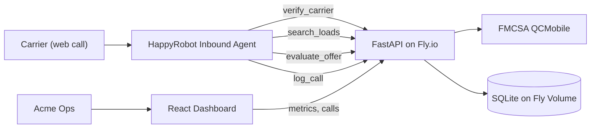

# Inbound Carrier Sales Agent — Build Document

**Prepared for:** Acme Logistics
**Prepared by:** Tim Bruckdorfer (FDE candidate, HappyRobot)
**Status:** v1.0 — proof of concept ready for live demo

---

## 1. Why this matters

Today, your carrier desk reps spend a meaningful share of their day answering inbound
calls that boil down to four repeatable steps:

1. Ask the carrier for their MC number and verify in FMCSA.
2. Find a load that fits their equipment and lane.
3. Pitch the load and the rate.
4. Negotiate within a margin band, then either book or politely close.

That's exactly the kind of high-volume, structured workflow a voice agent can handle —
freeing reps to focus on relationship-building, escalations, and the calls where human
judgment actually moves the needle.

This proof of concept shows what the end-to-end product looks like: a HappyRobot voice
agent backed by a small, secure API, with an operations dashboard your team can use on
Day 1.

## 2. What I built

A **single deployable service** (Docker → Fly.io) with three surfaces:

1. **A REST API** the HappyRobot agent calls during conversations:
   - `verify_carrier` (FMCSA QCMobile lookup, 1h cache)
   - `search_loads` (ranked by lane / equipment / pickup proximity)
   - `evaluate_offer` (round-aware negotiation policy with hard caps)
   - `log_call` (end-of-call extraction + classification ingestion)
2. **A HappyRobot inbound web-call workflow** that orchestrates the conversation and
   classifies the outcome and sentiment of each call.
3. **A custom React dashboard** that turns the call log into the KPIs your team
   actually cares about.

## 3. Architecture



Why this shape:

- **Separation of concerns.** HappyRobot owns the conversation. The API owns the
  business logic (verification, load matching, negotiation policy). That means we can
  evolve the prompts without re-deploying code, and we can swap voice vendors without
  rewriting the rules.
- **Testable, defensible negotiation.** The price floor and ceiling live in code (not
  in a prompt), unit-tested, and configurable per environment. The agent literally
  *cannot* commit you to a price below your floor.
- **Single image, single dependency.** One container serves both the API and the SPA.
  SQLite on a Fly volume keeps the Day-1 footprint minimal; swap to Postgres in one
  config change when you outgrow it.

## 4. The conversation flow

```
Greet → ask MC → verify_carrier → ineligible? polite decline + log
                              ↓ eligible
                  Ask equipment + lane → search_loads
                              ↓
                       Pitch top match
                              ↓
              Carrier counters? → evaluate_offer (round=1)
                  ↓ counter (round=2) → ↓ counter (round=3, final)
                          accept ← any round ←─────────────────┐
                              ↓                                 │
                  "Transferring you to a sales rep"             │
                              ↓                                 │
                Mock: "Transfer was successful…"                │
                              ↓                                 │
        End-of-call: extract + classify outcome + sentiment ────┘
                              ↓
                          log_call → DB
```

## 5. KPIs the dashboard surfaces

For your sales managers and ops leaders:

- **Total calls** and **conversion rate** (% booked).
- **Average margin Δ** vs listed rate (in $ and %) — your floor in action.
- **Average rounds** to deal — proxy for friction in your pricing.
- **Average sentiment score** and **eligible-rate** (FMCSA pass-through).
- **Outcome distribution** — booked / declined / no_match / ineligible /
  negotiation_failed / transferred / other.
- **Sentiment distribution.**
- **Equipment types** and **top lanes** — useful for procurement / pricing teams.
- **Calls over time** — calls and bookings per day.

Plus a filterable, exportable **calls table** with a side drawer that shows the full
transcript and every extracted field. Reps and managers can audit any call in two
clicks.

## 6. ROI hypothesis (to validate against your real volume)

| Lever | Mechanism | Expected impact |
|---|---|---|
| Rep time saved | Agent handles MC + lane + initial pitch + tier-1 negotiation autonomously | 60–80% of inbound triage time |
| Margin protection | Server-enforced floor; agent cannot promise below it | Eliminates accidental margin leakage on tier-1 calls |
| Capture-rate | 24/7 availability; no missed calls | Incremental bookings on off-hours and peak surges |
| Coaching feedback loop | Outcome + sentiment per call, tagged with rep / agent and load | Continuous prompt + policy tuning, transparent to your team |

## 7. Security & compliance posture

- **HTTPS** end-to-end (Fly.io auto-provisioned Let's Encrypt cert; `force_https`).
- **API-key authentication** (`X-API-Key`) on every business endpoint; the key is a
  Fly secret, rotatable in one command.
- **CORS allowlist** restricts which origins can call the API from the browser.
- **Rate limit** on `verify_carrier` (slowapi; 30/minute by default) to protect the
  FMCSA quota.
- **Strict input validation** (Pydantic) on every endpoint — no implicit type coercion.
- **Structured JSON logs** with a per-request UUID, ready for shipping to your SIEM.
- **Secrets management:** never in code, env files, or images — only in Fly secrets.
- **Audit trail:** every call lands in the `Call` table with full transcript + extracted
  fields, retrievable from the dashboard.

## 8. What's NOT in the v1 scope (and what's next)

- **Live transfer:** mocked per the brief — production would integrate with your
  existing dialer / Twilio / Vonage warm-transfer flow.
- **Postgres + multi-tenant:** trivial migration when needed (SQLModel works against
  both unchanged); SQLite was chosen for fastest reproducible deploy.
- **Per-rep authentication:** dashboard currently uses a single shared API key; SSO /
  per-user RBAC is a small follow-up.
- **Pricing intelligence:** today the floor is a percentage of `loadboard_rate`. A
  natural follow-up is dynamic floors driven by lane, equipment, day-of-week, and
  recent fill rate.
- **Live load board sync:** today loads are seeded from a CSV. Production would sync
  from your TMS / DAT / Truckstop on a schedule.
- **Voice transfer to specific reps:** route based on lane, equipment, or carrier
  history.

## 9. How to evaluate it

For the live demo I'll walk through:

1. **Setup** — the deployed dashboard, the HappyRobot workflow, and the codebase.
2. **Three live web calls** that exercise the system:
   - **Happy path** — eligible carrier, accepts listed rate, mock transfer.
   - **Negotiation** — counter offer, broker counter, accept on round 2.
   - **Ineligible carrier** — bogus MC, polite decline.
3. **Dashboard tour** — KPI movement, sentiment distribution, drill-down to a call.

Total run time: ~5 minutes (matches the rubric).
