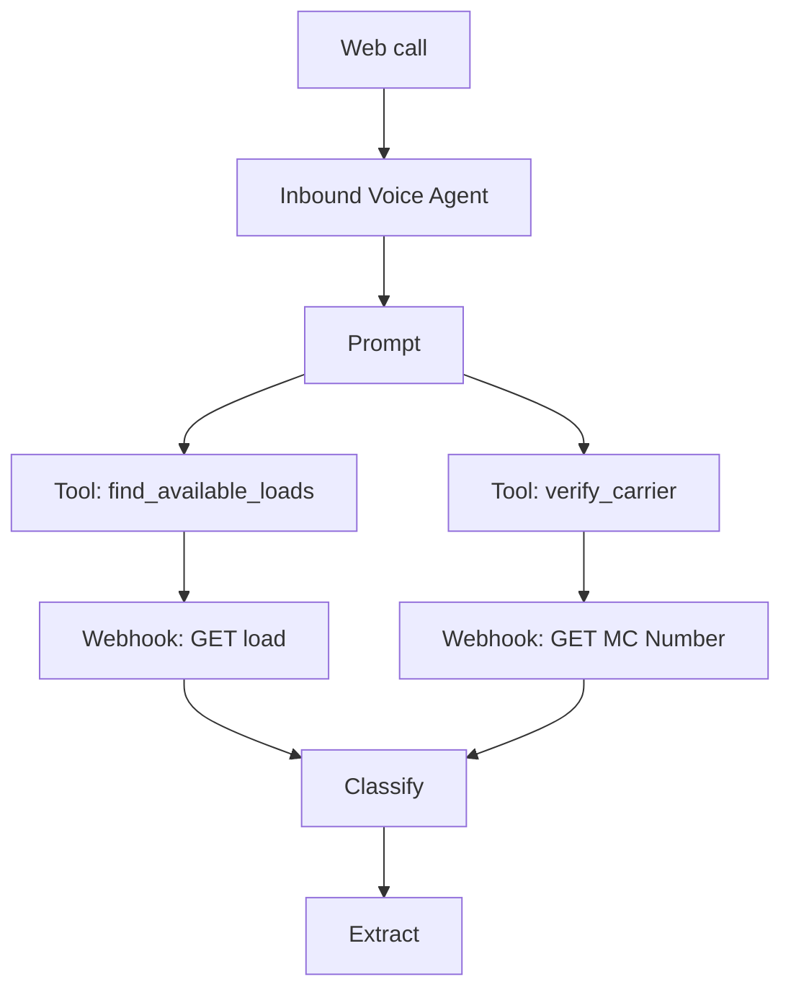

# HappyRobot Inbound Carrier Workflow — Adaptation Guide

This guide walks you through adapting the **HappyRobot-provided starter workflow**
(`Inbound Carrier Sales New / v1`) so it talks to **your** deployed FastAPI backend
and fully covers the brief's requirements (FMCSA verification, load search, up-to-3
rounds of negotiation, mock transfer, and persisted call analytics).

> **Trigger:** Web call (per the brief — do not buy a phone number).
> **Backend base URL:** `https://happyrobot-fde-tb.fly.dev`
> **API key:** the value of your Fly secret `API_KEY`, sent as header `x-api-key`.
> **Engine:** V3. The V2 starter must be upgraded — see the prerequisites below.

---

## Prerequisites — engine upgrade

Before you make any of the changes in this guide:

1. **Fork the starter workflow.** Forking creates an editable, isolated copy so
   you don't fight the live-version lock. (In the editor toolbar: `Fork`.)
2. **Take the "Upgrade this Version to new engine" action** in the upgrade banner
   at the top of the fork. The V2 engine is deprecated; V3 is the only path
   forward and it changes the variable-reference format, the agent first-message
   location, and several model IDs.
3. **Confirm you're now on V3.** A small `V3 engine` chip appears in the editor
   header. If you skip this step, every variable reference in this doc will be
   stored as plain text and will silently fail at runtime — see
   `troubleshooting_and_v3_migration.md` for what that looks like.

The rest of this guide assumes V3.

---

## What the starter template gives you

Out of the box, the template has these nodes wired to HappyRobot-hosted demo
endpoints:



What's missing (the gap you must close):

- **Negotiation** (`evaluate_offer`) — required by the brief's "up to 3 back-and-forths".
- **Persisting the call** — `Classify` + `Extract` produce data but it's not POSTed
  anywhere. Without this, your dashboard stays empty.
- **Lane/equipment fallback** — if the carrier doesn't have a reference number, the
  template hits a dead end. Add a `search_loads_by_lane` Tool.
- **Outcome coverage** — `Classify` only has 3 tags. Expand to 5 to cover ineligible
  carriers and "no match" outcomes.

---

## 1. Repoint the two existing Webhooks to your API

> **V3 variable-reference rule.** In V3, every variable reference in any config
> field must point at the upstream node by its `persistent_id`, not by name.
> Either pick the variable from the inline picker (recommended — it inserts a
> proper Plate `mention` node), or type the long form
> ``. The short form `{{mc_number}}` looks fine
> in the editor but is stored as plain text and is **not** resolved at runtime —
> your webhook will receive the literal string `{{mc_number}}`. See
> `troubleshooting_and_v3_migration.md` for the gory details.

### `POST MC Number` (the verify_carrier webhook)

| Field | Set to |
|---|---|
| URL | `https://happyrobot-fde-tb.fly.dev/api/verify_carrier` |
| Method | `POST` |
| Body field `mc_number` | inline-pick the parent `verify_carrier` tool's `mc_number` parameter (long form: `{{<verify_carrier_tool_persistent_id>.mc_number}}`) |
| Header `x-api-key` | your Fly `API_KEY` value |
| Response binding | bind `eligible`, `carrier_name`, `dot_number`, `reasons` |

The template's existing Tool (`verify_carrier`) doesn't need to change — its
parameter `mc_number` is already correct.

### `GET Load` (the find_available_loads webhook)

| Field | Set to |
|---|---|
| URL | `https://happyrobot-fde-tb.fly.dev/api/loads/{{<find_available_loads_tool_persistent_id>.reference_number}}` (use the inline picker) |
| Method | `GET` (already correct) |
| Params | _empty_ (path param is templated into the URL) |
| Header `x-api-key` | your Fly `API_KEY` value |
| Response binding | bind everything: `origin`, `destination`, `pickup_datetime`, `delivery_datetime`, `equipment_type`, `loadboard_rate`, `notes`, `weight`, `commodity_type`, `num_of_pieces`, `miles`, `dimensions` |

The template's existing Tool (`find_available_loads`) takes `reference_number` —
no change needed. Your seed data uses `REF1001`–`REF1020`.

---

## 2. Add three new nodes

### A. New Tool: `search_loads_by_lane` (fallback when no reference number)

Tool node config:

| Field | Value |
|---|---|
| Event Name | `search_loads_by_lane` |
| Description | `Find loads matching the carrier's lane and equipment type when they don't have a reference number.` |
| Message | `None - Don't say anything, just call the tool` |
| Parameter `equipment_type` | "The trailer type, e.g., reefer, dry van, flatbed." |
| Parameter `origin` | "The origin city or state the carrier is calling from." |
| Parameter `destination` | "Where they want to deliver." |

Wire it to a new Webhook node `POST search_loads`:

| Field | Value |
|---|---|
| URL | `https://happyrobot-fde-tb.fly.dev/api/search_loads` |
| Method | `POST` |
| Body field `equipment_type` | inline-pick the parent tool's `equipment_type` (long form: `{{<search_loads_by_lane_tool_id>.equipment_type}}`) |
| Body field `origin` | inline-pick the parent tool's `origin` |
| Body field `destination` | inline-pick the parent tool's `destination` |
| Body field `max_results` | static value `1` |
| Header `x-api-key` | your Fly `API_KEY` |
| Response binding | bind `count`, and from `loads[0]` bind `load_id` (use this as `reference_number` for the rest of the call), plus the load detail fields |

If `count == 0`, the agent should say "no match" and route to the closing.

### B. New Tool: `evaluate_offer` (the negotiation step)

Tool node config:

| Field | Value |
|---|---|
| Event Name | `evaluate_offer` |
| Description | `Decide whether to accept the carrier's price offer or counter. Always pass the round number (1, 2, or 3 — never higher).` |
| Message | `None - Don't say anything, just call the tool` |
| Parameter `reference_number` | "The load's reference number (already known from earlier)." |
| Parameter `carrier_offer` | "The dollar amount the carrier is offering." |
| Parameter `round` | "Negotiation round, starting at 1 and incrementing on each carrier counter." |
| Parameter `last_broker_price` | "Optional. The last price you (the broker) quoted; defaults to the loadboard rate." |

Wire it to a Webhook node `POST evaluate_offer`:

| Field | Value |
|---|---|
| URL | `https://happyrobot-fde-tb.fly.dev/api/evaluate_offer` |
| Method | `POST` |
| Body field `load_id` | inline-pick the parent tool's `reference_number` (long form: `{{<evaluate_offer_tool_id>.reference_number}}`) |
| Body field `carrier_offer` | inline-pick the parent tool's `carrier_offer` |
| Body field `round` | inline-pick the parent tool's `round` |
| Body field `last_broker_price` _(optional)_ | inline-pick if you want to forward it; otherwise omit |
| Header `x-api-key` | your Fly `API_KEY` |
| Response binding | bind `decision` (accept/counter/reject), `counter_price`, `rationale`, `floor`, `ceiling` |

### C. New Webhook (final node): `log_call` — persists the call to your DB

Place this **after** `Extract` (the very last node in the flow):

| Field | Value |
|---|---|
| Event Name | `log_call` |
| URL | `https://happyrobot-fde-tb.fly.dev/api/calls/happyrobot` |
| Method | `POST` |
| Header `x-api-key` | your Fly `API_KEY` |
| Body | configure as **key/value rows** (NOT raw JSON) — see below |

Configure each body field as a separate `key`/`value` row in the Webhook node's
Body panel. **Use the inline variable picker** for every value — it inserts a
proper Plate `mention` node referencing the upstream node by `persistent_id`. Do
not type `{{classify.tag}}` style short forms; V3 stores those as plain text and
your endpoint will literally receive the seven-character string `{{tag}}`.

| Body key | Value to pick (from inline picker) | Notes |
|---|---|---|
| `classification` | Classify → `response.classification` | Long form: `{{<classify_persistent_id>.response.classification}}` |
| `sentiment` | Sentiment → `response.classification` | (Note: it's `response.classification`, not `response.tag`.) |
| `reference_number` | Extract → `response.reference_number` | Note the `response.` prefix on every Extract field. |
| `mc_number` | Extract → `response.mc_number` | |
| `carrier_name` | Extract → `response.carrier_name` | See branching note below |
| `eligible` | _leave blank_ | See branching note below |
| `booking_decision` | Extract → `response.booking_decision` | |
| `decline_reason` | Extract → `response.decline_reason` | |
| `rounds` | Extract → `response.rounds` | |
| `loadboard_rate` | _leave blank_ | See branching note below |
| `final_carrier_offer` | Extract → `response.final_carrier_offer` | |
| `agreed_price` | Extract → `response.agreed_price` | |
| `transcript` | Inbound Voice Agent → `transcript` | |
| `call_duration` | Inbound Voice Agent → `duration` | |

**Why three fields are blank.** `POST log_call` lives on the
Extract → Sentiment → Classify branch. The four tool webhooks
(`POST MC Number`, `GET Load`, `POST search_loads`, `POST evaluate_offer`) are
on a **parallel branch** under the Prompt node, so their outputs are not in
`log_call`'s ancestor chain and cannot be referenced from it. That's why
`carrier_name` is sourced from the AI Extract instead of from the verify_carrier
API response, and why `eligible` and `loadboard_rate` are blank in the default
config.

If you want to populate `eligible` and `loadboard_rate` properly, the cleanest
fix is to add them as parameters to the **AI Extract** node so the LLM infers
them from the transcript:

- `eligible` (boolean): "true if the agent confirmed FMCSA eligibility and
  proceeded with the load, false if the agent declined the carrier."
- `loadboard_rate` (number): "the listed broker rate quoted on the load, in
  dollars."

Then map these new Extract response fields the same way as the others.

The backend's translation layer is forgiving: missing fields are tolerated, and
the only required field is `classification`.

---

## 3. Expand the existing AI nodes

> **Critical V3 gotcha — the `Input` field on every AI node must be a real
> variable reference, not the V2 short form.** In V3 you **must** click into
> the Input field and pick the upstream node's `transcript` variable from the
> inline picker (or type the long form
> `{{<inbound_voice_agent_persistent_id>.transcript}}`). Typing the V2 short
> form `{{transcript}}` looks like it works in the editor — it shows up as a
> tag — but V3 stores it as a plain-text string inside a Plate paragraph node
> and the runtime never resolves it. Your AI nodes will silently process the
> literal seven-character string `{{transcript}}` on every call. The same rule
> applies anywhere a variable is referenced (URLs, body fields, downstream
> nodes). The starter template ships with this bug in several places — fix it
> in Extract, Classify, Sentiment, all four tool webhooks, and `POST log_call`.

### `Classify` — expand from 3 tags to 5

**Model:** any V3 model from the picker. We use `gpt-4.1` (id: `turbo-one`).
The V2 ID `turbo` will silently fail the agent worker dispatch — make sure the
picker shows the new V3 ID.

**Input:** inline-pick `transcript` from the **Inbound Voice Agent** node
(long form: `{{<inbound_voice_agent_persistent_id>.transcript}}`).

**Prompt:** replace the starter 3-tag prompt with:

```
You are a call analytics assistant. Classify the completed inbound carrier call
based on the transcript. Choose exactly one of these five tags:

- "Success" — the carrier agreed to book the load.
- "Rate too high" — the carrier declined because the price did not work after
  negotiation.
- "Not interested" — the carrier declined for any other reason (e.g., wrong
  lane, wrong equipment, schedule).
- "Ineligible carrier" — the FMCSA verification failed (or the agent rejected
  the carrier on those grounds).
- "No match" — no suitable load was found in the catalog for this carrier.

Return only the tag, nothing else.
```

**Tags** — the values must match the prompt exactly (case and spelling matter
for the backend's mapping):

| Tag | Definition |
|---|---|
| `Success` | Carrier agreed to book the load. |
| `Rate too high` | Carrier declined because the price didn't work after negotiation. |
| `Not interested` | Carrier declined for any other reason. |
| `Ineligible carrier` | FMCSA verification failed (or the carrier was rejected). |
| `No match` | No suitable load was found in the catalog. |

(Fix the existing typo: `Sucess` → `Success`.)

The backend translation layer maps these to the canonical outcomes the dashboard
displays:
`Success → booked`, `Rate too high → negotiation_failed`,
`Not interested → declined`, `Ineligible carrier → ineligible_carrier`,
`No match → no_match`. Anything unrecognized falls back to `other`.

### Add a second AI node: `Sentiment`

Mirror the `Classify` setup.

**Model:** same as Classify (`gpt-4.1` / `turbo-one`).

**Input:** inline-pick `transcript` from the Inbound Voice Agent node — same
rule as Classify. Do not use the V2 short form `{{transcript}}`.

**Prompt:**

```
You are a call analytics assistant. Read the transcript of an inbound carrier
call and label the carrier's overall tone with exactly one of:

- "positive" — warm, agreeable, or upbeat.
- "neutral" — standard, transactional tone.
- "negative" — frustrated, pushy, or hostile.

Return only the tag, nothing else.
```

**Tags:**

| Tag | Definition |
|---|---|
| `positive` | Carrier was warm, agreeable, or upbeat. |
| `neutral` | Standard, transactional tone. |
| `negative` | Frustrated, pushy, or hostile. |

If you skip adding this node, the backend will default sentiment based on outcome
(booked → positive; negotiation_failed → negative; everything else → neutral).

### `Extract` — expand the field list

**Model:** same as Classify (`gpt-4.1` / `turbo-one`).

**Input:** inline-pick `transcript` from the Inbound Voice Agent node — same
rule as Classify. Do not use the V2 short form `{{transcript}}`.

**Prompt:** replace the starter prompt with:

```
You are an information extraction assistant. From the transcript of an inbound
carrier call, extract the following fields. If a field is not mentioned or not
applicable, return an empty string for it (do not invent values).

Return a JSON object with exactly these keys:

- reference_number: the load reference (e.g., "REF1001"). Empty if none.
- mc_number: the carrier's MC number (digits only). Empty if none.
- carrier_name: the carrier's company name as confirmed during verification.
- booking_decision: "yes" if the carrier agreed to book the load, "no" if not.
- decline_reason: short reason if declined (e.g., "rate too high",
  "not interested", "wrong lane"). Empty if booked.
- rounds: integer 0–3 — number of negotiation back-and-forths that happened.
- final_carrier_offer: the carrier's last offered price in dollars (number
  only, no currency symbol). Empty if no offer was made.
- agreed_price: the price the deal closed at in dollars. Empty if not booked.
```

**Fields** (Extract's output schema — names must match exactly so the `log_call`
body picks them up):

| Field | Description | Example |
|---|---|---|
| `reference_number` | Load referenced during the call | `REF1001` |
| `mc_number` | Carrier's MC | `1521248` |
| `carrier_name` | Carrier's company name (already verified) | `ABC Trucking` |
| `booking_decision` | "yes" if they agreed to book, "no" if not | `yes` |
| `decline_reason` | If "no": "rate too high" / "not interested" / etc. | `rate too high` |
| `rounds` | Number of negotiation back-and-forths (0–3) | `2` |
| `final_carrier_offer` | The carrier's last offer in dollars | `2050` |
| `agreed_price` | The price the deal closed at, or null | `2050` |

---

## 4. Configure the Inbound Voice Agent node

These are the fields on the **Agent node itself** (not the Prompt). The starter
template's defaults are V2-stale and will cause the voice session to fail
immediately with `Status: failed, Duration: 0, Room: n/a`.

| Field | Set to | Why |
|---|---|---|
| `agent.name` | `Paul` | No trailing whitespace. The starter ships with `"Paul "` (with trailing space). Cosmetic, but trim it for cleanliness. |
| `agent.voices` | pick a real voice from the picker, e.g. `Paul` (`m357hexpjk2s`) | The voice metadata declares its expected language and accent — your agent config must match those. |
| `agent.languages` | `English` (id `en`) | Language is two-letter. |
| `agent.language_accents` | `English (US)` (id `en-us`) | **Critical** — must be a locale (`en-us`), not the bare language (`en`). The voice's `accent_key` is `en-us`; if the agent says `en`, the worker's voice binding fails and the session is torn down before the agent can speak. |
| `background` | leave default (`call-center.8k.wav`) or set your own | Cosmetic. |
| `max_silence_hold_duration` | `4` (seconds) | **Important** — without this, the call never ends after the agent's closing line. The LLM has no built-in way to "hang up" from inside the prompt; the platform ends the call when this silence threshold is hit. 4s is short enough that the call closes crisply after the agent's "Thanks for calling…" but long enough not to cut off natural conversational pauses. |
| `max_call_duration` | `600` (seconds) | Hard ceiling so a stuck call can't run forever. 10 minutes is plenty for this use case. |

The Prompt node (immediately under the Agent in the DAG) carries the model and
the initial message:

| Field | Set to |
|---|---|
| `model` | `gpt-4.1` (id `turbo-one`). The V2 ID `turbo` is invalid in V3 and silently fails. |
| `initial_message` | `Thank you for calling Happy Robot Logistics, how can I help?` (or your variant) |

> **Why this matters.** During debugging, the voice session terminated in <1s
> *every single time* until both the model ID and the language accent were
> migrated to V3 values. Either bug alone reproduces the failure. Both are
> account-invisible (no error surfaces in the UI; the run completes "successfully"
> from the workflow perspective even though the underlying session failed).

## 5. Replace the prompt

Open the `Prompt` node and replace its content with the block below. This fills the
two `⚠️ (Part missing)` gaps and adds explicit negotiation instructions plus tool-call
sequencing.

> The prompt below was rewritten to clear all 7 V3 prompt-validator issues
> the starter triggered (3× verbose duplicates, 2× TTS-unfriendly tokens,
> missing TTS guidance, dangling `transfer_to_colleague` tool reference). It's
> what's currently live in the workspace's published version. The string
> placeholders inside double-curlies (`{{reasons}}`, `{{carrier_name}}`,
> `{{counter_price}}`) are **prompt-time references** that the LLM resolves
> from tool outputs at runtime — they are NOT V3 workflow-variable references
> and don't need to use persistent IDs. Workflow-variable references are only
> needed in node configuration fields, not in prompt text.

````
### Background

You are a **carrier sales representative** working for **Happy Robot Logistics**. You handle inbound phone calls from carriers looking to book loads.

### Goal

Vet the caller against FMCSA, find them a suitable load, negotiate the price within policy (max 3 back-and-forths), and either book the load or close politely. Hard rules:

1. ALWAYS verify the carrier's MC number BEFORE pitching a load.
2. NEVER negotiate beyond 3 rounds. The `evaluate_offer` tool returns `decision="reject"` on round 3 if you cannot get to a deal — accept that outcome.
3. NEVER promise a price below the floor that `evaluate_offer` returns. Quote the `counter_price` the tool gives you and keep moving.

---

### How You Will Operate

**Introduction.** The caller is most likely calling about a load they saw on an online posting.

**Getting the load number.** Ask: "Do you see a reference number on that posting?" Wait for the response.
- If they have one (format: REF followed by four or five digits, e.g. REF1001), store it as `reference_number` and skip to *Carrier Qualification*.
- If they don't, ask: "What is the lane, and trailer type?" Wait for the lane and equipment type, then call the `search_loads_by_lane` tool. If `count` is 0, apologize and skip to *Closing (no deal)*. Otherwise use the returned `load_id` as the `reference_number` and continue.

**Carrier Qualification.** Ask: "What's your MC number?" Wait for the response, then call the `verify_carrier` tool with the `mc_number`.
- If `eligible` is false: politely decline ("Unfortunately I am not able to book with your authority right now — the FMCSA registry shows the carrier is not currently eligible.") and skip to *Closing (no deal)*.
- If `eligible` is true: confirm the carrier name back, e.g. "Is this A B C Trucking?" using the `carrier_name` returned by the tool. If the carrier name is not what the caller expected, ask for the MC number again.

**Finding a Load.** Now that the MC number is verified and the company is confirmed, call `find_available_loads` with the `reference_number`. Confirm load details with the caller in a natural, phone-friendly way (see *Style* below for how to read numbers and times).

**Pitching and Negotiation.**
- If the caller accepts the listed rate, set `rounds=0`, `agreed_price=loadboard_rate`, and skip to *Closing (booked)*.
- If the caller counters, call `evaluate_offer` with their offer and `round=1`. Each subsequent counter increments `round`.
  - `decision="accept"` → set `agreed_price=carrier_offer` and skip to *Closing (booked)*.
  - `decision="counter"` → quote the counter using the `counter_price` the tool returned, e.g. "Best I can do is fourteen hundred dollars." Wait for the caller. If they accept, set `agreed_price=counter_price` and go to *Closing (booked)*. If they counter again, call `evaluate_offer` with the new offer and `round` incremented.
  - `decision="reject"` (only at `round=3`) → say something like "I cannot get below fourteen hundred dollars on this one. If that doesn't work, I totally understand." Skip to *Closing (no deal)*.

**Closing (booked).** Confirm the booking warmly: "Great, you're booked. We'll send the rate confirmation over shortly. Thanks for calling Happy Robot Logistics." End the call.

**Closing (no deal).** Let the caller know that if anything changes, someone from your team will call them back. Remind them to visit "happy robot loads dot com" for available loads. Wait for the caller to respond. Thank them and end the call.

---

### Style

- Keep responses concise and natural — speak as if on the phone.
- Use simple, conversational language. A few filler words are fine ("okay", "alright", "sure thing"). Avoid sounding robotic or overly formal.
- **Numbers and units (read for TTS, do not write digits or symbols):**
  - Prices: say "thirteen hundred dollars" or "one thousand three hundred dollars", not "$1,300".
  - Distances and lengths: say "fifty-three feet", not "53 feet".
  - Weights: say "forty thousand pounds", not "40,000 pounds".
  - Times: say "three P M" or "three in the afternoon", not "3 PM". Say "four A M", not "4 AM".
  - Dates: say "Friday, July twelfth", not "Friday, July 12th".
  - MC numbers: read each digit individually ("one five two one two four eight").
  - URLs: say each word separately ("happy robot loads dot com").
  - Abbreviations: spell out ("M C number", not "MC#"; "T W I C", not "TWIC").

(Plus a worked example call demonstrating the above. See the live Prompt node
in the workspace for the full text.)
````

> Note the closing was changed from "transfer to a sales rep" (which referenced
> a non-existent `transfer_to_colleague` tool and triggered a `tool_does_not_exist`
> validation issue blocking publish) to a verbal booking confirmation. This
> matches the brief's "mock transfer" requirement — you're confirming the deal
> verbally and ending the call, which is functionally equivalent for a demo.

---

## 6. Publish the workflow

Publishing in V3 has two gotchas the UI hides:

1. **Locked-version edits.** Once a version is published it auto-locks. To make
   further edits, either fork the version (creates a new editable copy) or use
   `manage_versions action="unpublish"` (which auto-unlocks). After edits,
   republish.
2. **Silent publish failures from prompt-validator issues.** If the Prompt node
   has unresolved quality issues (e.g. the dangling `transfer_to_colleague`
   reference, or duplicated/TTS-unfriendly text), publish fails with
   `Cannot publish: some prompt nodes have open issues`. The browser UI may
   not surface this clearly — it can look like the publish "just didn't take".
   Use `mcp__happyrobot-ai__fix_prompt_issues` to enumerate the issues, fix
   them, then publish (with `skip_prompt_validation=true` if async re-analysis
   hasn't caught up to your edits yet).

Easiest path via MCP:
```
mcp__happyrobot-ai__manage_versions(
  action="publish",
  version_id=<your version>,
  environment="production",
  skip_prompt_validation=true,
  force=true
)
```

After publishing, confirm with:
```
mcp__happyrobot-ai__get_workflow_details(workflow_id) →
  expect Published: true, Live: true on the latest version
```

## 7. Validate end-to-end before recording

Once everything's wired, smoke-test the API directly to make sure your endpoints are
reachable from outside:

```bash
BASE=https://happyrobot-fde-tb.fly.dev
KEY=<your API_KEY>

curl -s "$BASE/healthz"

curl -sf "$BASE/api/loads/REF1001" -H "X-API-Key: $KEY" | jq .load_id

curl -sf -X POST "$BASE/api/verify_carrier" \
  -H "X-API-Key: $KEY" -H "Content-Type: application/json" \
  -d '{"mc_number":"123456"}' | jq '.eligible, .carrier_name'

curl -sf -X POST "$BASE/api/evaluate_offer" \
  -H "X-API-Key: $KEY" -H "Content-Type: application/json" \
  -d '{"load_id":"REF1001","carrier_offer":2100,"round":1}' | jq '.decision, .counter_price'

curl -sf -X POST "$BASE/api/calls/happyrobot" \
  -H "X-API-Key: $KEY" -H "Content-Type: application/json" \
  -d '{"classification":"Success","reference_number":"REF1001","mc_number":"123456",
       "agreed_price":2400,"loadboard_rate":2450,"rounds":1}' | jq .outcome
```

Then run a test web call from the HappyRobot platform and confirm the call shows up
in your dashboard at `https://happyrobot-fde-tb.fly.dev/`.

After the call, verify the **session** (not just the workflow run) actually
attached to a LiveKit room:

```
mcp__happyrobot-ai__monitor_runs(action="sessions", run_id=<your run>)
# Expect: Status: completed, Duration > 0, Room: <some id>
# If you see Status: failed, Duration: 0, Room: n/a, the agent worker never
# attached — see troubleshooting_and_v3_migration.md.
```

If your dashboard still shows literal `{{...}}` strings after a successful
session, you have unconverted V2-style references in `POST log_call`'s body or
in the AI nodes' inputs. Run
`mcp__happyrobot-ai__fix_broken_vars(version_id, dry_run=true)` — it should
report `0 broken, 0 unfixable`. Anything else means at least one variable is
stored as plain text.

## 8. Mapping cheat sheet (template node ↔ your API)

| HappyRobot node | Backend endpoint | Auth | Method |
|---|---|---|---|
| `verify_carrier` Tool / `POST MC Number` Webhook | `POST /api/verify_carrier` | `x-api-key` header | POST |
| `find_available_loads` Tool / `GET Load` Webhook | `GET /api/loads/{reference_number}` | `x-api-key` header | GET |
| `search_loads_by_lane` Tool (NEW) | `POST /api/search_loads` | `x-api-key` header | POST |
| `evaluate_offer` Tool (NEW) | `POST /api/evaluate_offer` | `x-api-key` header | POST |
| `log_call` Webhook (NEW, final node) | `POST /api/calls/happyrobot` | `x-api-key` header | POST |

That's it. The dashboard reads `GET /api/metrics` and `GET /api/calls` automatically.

---

## See also

- **`troubleshooting_and_v3_migration.md`** — the full debugging journey, the
  symptoms each bug presented, the dead ends we ruled out, and an exact MCP
  call sequence to reproduce the fixes if you ever need to migrate another
  workflow from V2 → V3.
