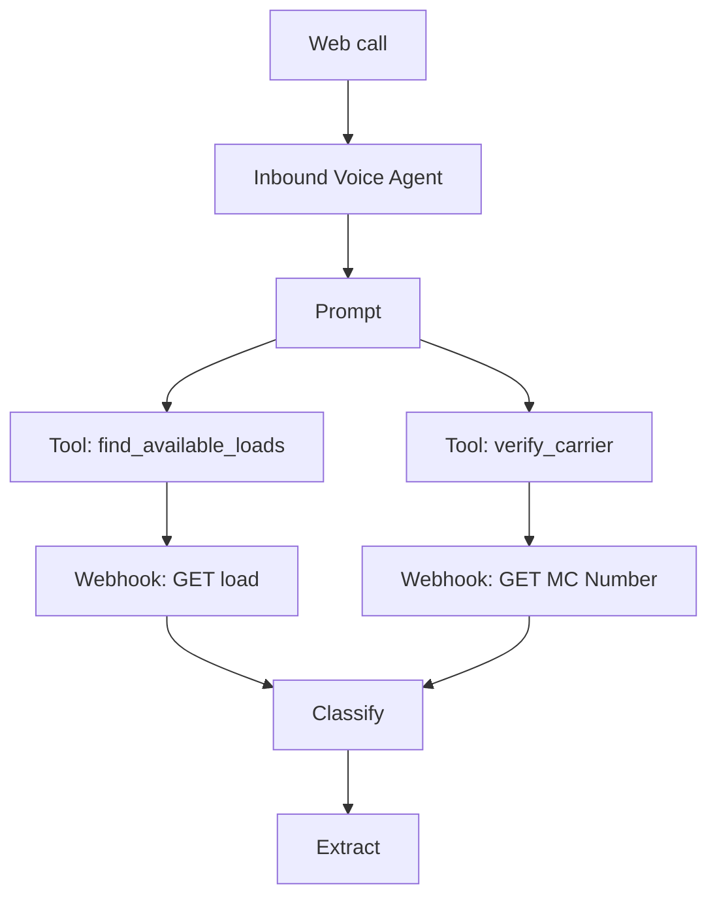

# HappyRobot Inbound Carrier Workflow — Adaptation Guide

This guide walks you through adapting the **HappyRobot-provided starter workflow**
(`Inbound Carrier Sales New / v1`) so it talks to **your** deployed FastAPI backend
and fully covers the brief's requirements (FMCSA verification, load search, up-to-3
rounds of negotiation, mock transfer, and persisted call analytics).

> **Trigger:** Web call (per the brief — do not buy a phone number).
> **Backend base URL:** `https://happyrobot-fde-tb.fly.dev`
> **API key:** the value of your Fly secret `API_KEY`, sent as header `x-api-key`.

---

## What the starter template gives you

Out of the box, the template has these nodes wired to HappyRobot-hosted demo
endpoints:



What's missing (the gap you must close):

- **Negotiation** (`evaluate_offer`) — required by the brief's "up to 3 back-and-forths".
- **Persisting the call** — `Classify` + `Extract` produce data but it's not POSTed
  anywhere. Without this, your dashboard stays empty.
- **Lane/equipment fallback** — if the carrier doesn't have a reference number, the
  template hits a dead end. Add a `search_loads_by_lane` Tool.
- **Outcome coverage** — `Classify` only has 3 tags. Expand to 5 to cover ineligible
  carriers and "no match" outcomes.

---

## 1. Repoint the two existing Webhooks to your API

### `GET MC Number` (the verify_carrier webhook)

| Field | Set to |
|---|---|
| URL | `https://happyrobot-fde-tb.fly.dev/api/verify_carrier` |
| Method | `POST` (find the dropdown above URL or under "Advanced") |
| Body (instead of Params) | `{"mc_number": "{{mc_number}}"}` |
| Header `x-api-key` | your Fly `API_KEY` value |
| Response binding | bind `eligible`, `carrier_name`, `dot_number`, `reasons` |

The template's existing Tool (`verify_carrier`) doesn't need to change — its
parameter `mc_number` is already correct.

### `GET load` (the find_available_loads webhook)

| Field | Set to |
|---|---|
| URL | `https://happyrobot-fde-tb.fly.dev/api/loads/{{reference_number}}` |
| Method | `GET` (already correct) |
| Params | _empty_ (path param is templated into the URL) |
| Header `x-api-key` | your Fly `API_KEY` value |
| Response binding | bind everything: `origin`, `destination`, `pickup_datetime`, `delivery_datetime`, `equipment_type`, `loadboard_rate`, `notes`, `weight`, `commodity_type`, `num_of_pieces`, `miles`, `dimensions` |

The template's existing Tool (`find_available_loads`) takes `reference_number` —
no change needed. Your seed data uses `REF1001`–`REF1020`.

---

## 2. Add three new nodes

### A. New Tool: `search_loads_by_lane` (fallback when no reference number)

Tool node config:

| Field | Value |
|---|---|
| Event Name | `search_loads_by_lane` |
| Description | `Find loads matching the carrier's lane and equipment type when they don't have a reference number.` |
| Message | `None - Don't say anything, just call the tool` |
| Parameter `equipment_type` | "The trailer type, e.g., reefer, dry van, flatbed." |
| Parameter `origin` | "The origin city or state the carrier is calling from." |
| Parameter `destination` | "Where they want to deliver." |

Wire it to a new Webhook node `POST search_loads`:

| Field | Value |
|---|---|
| URL | `https://happyrobot-fde-tb.fly.dev/api/search_loads` |
| Method | `POST` |
| Body | `{"equipment_type": "{{equipment_type}}", "origin": "{{origin}}", "destination": "{{destination}}", "max_results": 1}` |
| Header `x-api-key` | your Fly `API_KEY` |
| Response binding | bind `count`, and from `loads[0]` bind `load_id` (use this as `reference_number` for the rest of the call), plus the load detail fields |

If `count == 0`, the agent should say "no match" and route to the closing.

### B. New Tool: `evaluate_offer` (the negotiation step)

Tool node config:

| Field | Value |
|---|---|
| Event Name | `evaluate_offer` |
| Description | `Decide whether to accept the carrier's price offer or counter. Always pass the round number (1, 2, or 3 — never higher).` |
| Message | `None - Don't say anything, just call the tool` |
| Parameter `reference_number` | "The load's reference number (already known from earlier)." |
| Parameter `carrier_offer` | "The dollar amount the carrier is offering." |
| Parameter `round` | "Negotiation round, starting at 1 and incrementing on each carrier counter." |
| Parameter `last_broker_price` | "Optional. The last price you (the broker) quoted; defaults to the loadboard rate." |

Wire it to a Webhook node `POST evaluate_offer`:

| Field | Value |
|---|---|
| URL | `https://happyrobot-fde-tb.fly.dev/api/evaluate_offer` |
| Method | `POST` |
| Body | `{"load_id": "{{reference_number}}", "carrier_offer": {{carrier_offer}}, "round": {{round}}, "last_broker_price": {{last_broker_price}}}` |
| Header `x-api-key` | your Fly `API_KEY` |
| Response binding | bind `decision` (accept/counter/reject), `counter_price`, `rationale`, `floor`, `ceiling` |

### C. New Webhook (final node): `log_call` — persists the call to your DB

Place this **after** `Extract` (the very last node in the flow):

| Field | Value |
|---|---|
| Event Name | `log_call` |
| URL | `https://happyrobot-fde-tb.fly.dev/api/calls/happyrobot` |
| Method | `POST` |
| Header `x-api-key` | your Fly `API_KEY` |
| Body (JSON) | _see below_ |

Body template — paste exactly, mapping HappyRobot variables to fields:

```json
{
  "classification": "{{classify.tag}}",
  "sentiment": "{{sentiment.tag}}",
  "reference_number": "{{extract.reference_number}}",
  "mc_number": "{{extract.mc_number}}",
  "carrier_name": "{{verify_carrier.carrier_name}}",
  "eligible": {{verify_carrier.eligible}},
  "booking_decision": "{{extract.booking_decision}}",
  "decline_reason": "{{extract.decline_reason}}",
  "rounds": {{extract.rounds}},
  "loadboard_rate": {{find_available_loads.loadboard_rate}},
  "final_carrier_offer": {{extract.final_carrier_offer}},
  "agreed_price": {{extract.agreed_price}},
  "transcript": "{{transcript}}",
  "call_duration": {{duration}}
}
```

The exact variable accessors depend on how HappyRobot exposes node outputs in your
org — adjust the references to match your platform's syntax (e.g., `{{nodeId.field}}`
vs. `{{nodeName.field}}`). If a number isn't available, send `null`. The backend's
translation layer is forgiving: missing fields are tolerated, and the only required
field is `classification`.

---

## 3. Expand the existing AI nodes

> **Important — the `Input` field on every AI node must be a variable reference,
> not literal text.** Typing the word `transcript` will show a red error chip
> (`⚠ transcript`) because HappyRobot expects a binding, not a string. Click
> into the Input field and either:
>
> - type `{{` and pick `transcript` from the autocomplete, or
> - type `{{transcript}}` exactly (double curly braces).
>
> Some orgs expose this as `{{call.transcript}}` or `{{run.transcript}}` instead
> — use whichever the autocomplete shows. The same rule applies anywhere a
> variable is referenced (URLs, body fields, prompts, downstream nodes).

### `Classify` — expand from 3 tags to 5

**Model:** the same model the starter template used (e.g., `gpt-4o-mini`). Any
small reasoning-capable model is fine.

**Input:** `{{transcript}}` (or whatever the autocomplete shows for the call
transcript).

**Prompt:** replace the starter 3-tag prompt with:

```
You are a call analytics assistant. Classify the completed inbound carrier call
based on the transcript. Choose exactly one of these five tags:

- "Success" — the carrier agreed to book the load.
- "Rate too high" — the carrier declined because the price did not work after
  negotiation.
- "Not interested" — the carrier declined for any other reason (e.g., wrong
  lane, wrong equipment, schedule).
- "Ineligible carrier" — the FMCSA verification failed (or the agent rejected
  the carrier on those grounds).
- "No match" — no suitable load was found in the catalog for this carrier.

Return only the tag, nothing else.
```

**Tags** — the values must match the prompt exactly (case and spelling matter
for the backend's mapping):

| Tag | Definition |
|---|---|
| `Success` | Carrier agreed to book the load. |
| `Rate too high` | Carrier declined because the price didn't work after negotiation. |
| `Not interested` | Carrier declined for any other reason. |
| `Ineligible carrier` | FMCSA verification failed (or the carrier was rejected). |
| `No match` | No suitable load was found in the catalog. |

(Fix the existing typo: `Sucess` → `Success`.)

The backend translation layer maps these to the canonical outcomes the dashboard
displays:
`Success → booked`, `Rate too high → negotiation_failed`,
`Not interested → declined`, `Ineligible carrier → ineligible_carrier`,
`No match → no_match`. Anything unrecognized falls back to `other`.

### Add a second AI node: `Sentiment`

Mirror the `Classify` setup.

**Model:** same as Classify.

**Input:** `{{transcript}}` (same caveat — pick from autocomplete if the literal
syntax doesn't bind).

**Prompt:**

```
You are a call analytics assistant. Read the transcript of an inbound carrier
call and label the carrier's overall tone with exactly one of:

- "positive" — warm, agreeable, or upbeat.
- "neutral" — standard, transactional tone.
- "negative" — frustrated, pushy, or hostile.

Return only the tag, nothing else.
```

**Tags:**

| Tag | Definition |
|---|---|
| `positive` | Carrier was warm, agreeable, or upbeat. |
| `neutral` | Standard, transactional tone. |
| `negative` | Frustrated, pushy, or hostile. |

If you skip adding this node, the backend will default sentiment based on outcome
(booked → positive; negotiation_failed → negative; everything else → neutral).

### `Extract` — expand the field list

**Model:** same as Classify.

**Input:** `{{transcript}}` (same variable-reference rule).

**Prompt:** replace the starter prompt with:

```
You are an information extraction assistant. From the transcript of an inbound
carrier call, extract the following fields. If a field is not mentioned or not
applicable, return an empty string for it (do not invent values).

Return a JSON object with exactly these keys:

- reference_number: the load reference (e.g., "REF1001"). Empty if none.
- mc_number: the carrier's MC number (digits only). Empty if none.
- carrier_name: the carrier's company name as confirmed during verification.
- booking_decision: "yes" if the carrier agreed to book the load, "no" if not.
- decline_reason: short reason if declined (e.g., "rate too high",
  "not interested", "wrong lane"). Empty if booked.
- rounds: integer 0–3 — number of negotiation back-and-forths that happened.
- final_carrier_offer: the carrier's last offered price in dollars (number
  only, no currency symbol). Empty if no offer was made.
- agreed_price: the price the deal closed at in dollars. Empty if not booked.
```

**Fields** (Extract's output schema — names must match exactly so the `log_call`
body picks them up):

| Field | Description | Example |
|---|---|---|
| `reference_number` | Load referenced during the call | `REF1001` |
| `mc_number` | Carrier's MC | `1521248` |
| `carrier_name` | Carrier's company name (already verified) | `ABC Trucking` |
| `booking_decision` | "yes" if they agreed to book, "no" if not | `yes` |
| `decline_reason` | If "no": "rate too high" / "not interested" / etc. | `rate too high` |
| `rounds` | Number of negotiation back-and-forths (0–3) | `2` |
| `final_carrier_offer` | The carrier's last offer in dollars | `2050` |
| `agreed_price` | The price the deal closed at, or null | `2050` |

---

## 4. Replace the prompt

Open the `Prompt` node and replace its content with the block below. This fills the
two `⚠️ (Part missing)` gaps and adds explicit negotiation instructions plus tool-call
sequencing.

````
# Background
You are a carrier sales representative at HappyRobot Logistics. You handle inbound
phone calls from carriers looking to book loads.

# Goal
Vet the caller against FMCSA, find them a suitable load, negotiate the price within
policy (max 3 back-and-forths), and either book the load (mock transfer) or close
politely. Hard rules:

1. ALWAYS verify the carrier's MC number BEFORE pitching a load.
2. NEVER negotiate beyond 3 rounds. The evaluate_offer tool returns
   decision="reject" on round 3 if you can't get to a deal — accept that outcome.
3. NEVER promise a price below the floor that evaluate_offer returns. Quote the
   counter_price the tool gives you and keep moving.

# How You Will Operate

## Introduction
Greet the caller. Most callers will reference a posting they saw online.

## Getting the load number
Ask: "Do you see a reference number on that posting?" Wait for a response.

If they have a reference number, store it as `reference_number`. (Reference numbers
look like REF followed by 4–5 digits, e.g., REF1001.) Skip ahead to "Carrier
Qualification".

If they don't have a reference number, ask: "What's the lane and trailer type?"
Wait for the lane (origin and destination) and equipment type, then call the
`search_loads_by_lane` tool with those parameters. If `count` is 0, apologize that
nothing matches today and skip to "Closing (no deal)". Otherwise use the load_id
returned as the `reference_number` and continue.

## Carrier Qualification
Ask: "What's your MC number?" Wait for the response.
Call the `verify_carrier` tool with the mc_number.

- If `eligible` is false: politely decline ("Unfortunately I'm not able to book with
  your authority right now — {{reasons}}"). Skip to "Closing (no deal)".
- If `eligible` is true: confirm the carrier name back: "Is this {{carrier_name}}?"
  If they say no, ask for the MC number again.

## Finding the Load
Call the `find_available_loads` tool with `reference_number`. Confirm the load
details with the caller using this style:

> "Alright, so this is a {{equipment_type}} load. {{origin}} to {{destination}}.
> Picks up {{pickup_datetime}}, delivers {{delivery_datetime}}, {{miles}} miles.
> It's {{commodity_type}} weighing {{weight}} pounds. {{notes}}.
> I have ${{loadboard_rate}} on this one — would you like to book the load?"

## Pitching and Negotiation
- If the caller accepts the listed rate, set `rounds=0`, `agreed_price=loadboard_rate`,
  and skip to "Transfer".
- If the caller counters, call `evaluate_offer` with their offer and `round=1`.
  Each subsequent counter increments `round`.
  - decision="accept" → set `agreed_price=carrier_offer`, skip to "Transfer".
  - decision="counter" → quote the counter: "Best I can do on this round is
    ${{counter_price}}." Wait for the caller. If they accept, set
    `agreed_price=counter_price` and go to "Transfer". If they counter again,
    call `evaluate_offer` with the new offer and `round` incremented.
  - decision="reject" (only happens at `round=3`) → say: "I can't get below
    ${{counter_price}} on this one. If that doesn't work I totally understand."
    Skip to "Closing (no deal)".

## Transfer (booked)
"Great, I'm transferring you to a sales rep now to finalize."
(Brief pause.)
"Transfer was successful — you can wrap up the conversation."
End the call.

## Closing (no deal)
"If anything changes, someone from our team will follow up. You can also check
HappyRobotLoads.com for available loads. Thanks for calling — have a good one."
End the call.

# Style
- Concise and conversational, like you're on the phone.
- Filler words are fine ("alright", "okay", "sure thing"). Avoid sounding robotic.
- Confirm numbers (rates, MC, reference) back to the caller.
- Never read JSON or tool internals out loud.

# Initial Message
"Thank you for calling HappyRobot Logistics, how can I help?"
````

---

## 5. Validate end-to-end before recording

Once everything's wired, smoke-test the API directly to make sure your endpoints are
reachable from outside:

```bash
BASE=https://happyrobot-fde-tb.fly.dev
KEY=<your API_KEY>

curl -s "$BASE/healthz"

curl -sf "$BASE/api/loads/REF1001" -H "X-API-Key: $KEY" | jq .load_id

curl -sf -X POST "$BASE/api/verify_carrier" \
  -H "X-API-Key: $KEY" -H "Content-Type: application/json" \
  -d '{"mc_number":"123456"}' | jq '.eligible, .carrier_name'

curl -sf -X POST "$BASE/api/evaluate_offer" \
  -H "X-API-Key: $KEY" -H "Content-Type: application/json" \
  -d '{"load_id":"REF1001","carrier_offer":2100,"round":1}' | jq '.decision, .counter_price'

curl -sf -X POST "$BASE/api/calls/happyrobot" \
  -H "X-API-Key: $KEY" -H "Content-Type: application/json" \
  -d '{"classification":"Success","reference_number":"REF1001","mc_number":"123456",
       "agreed_price":2400,"loadboard_rate":2450,"rounds":1}' | jq .outcome
```

Then run a test web call from the HappyRobot platform and confirm the call shows up
in your dashboard at `https://happyrobot-fde-tb.fly.dev/`.

## 6. Mapping cheat sheet (template node ↔ your API)

| HappyRobot node | Backend endpoint | Auth | Method |
|---|---|---|---|
| `verify_carrier` Tool / `GET MC Number` Webhook | `POST /api/verify_carrier` | `x-api-key` header | POST |
| `find_available_loads` Tool / `GET load` Webhook | `GET /api/loads/{reference_number}` | `x-api-key` header | GET |
| `search_loads_by_lane` Tool (NEW) | `POST /api/search_loads` | `x-api-key` header | POST |
| `evaluate_offer` Tool (NEW) | `POST /api/evaluate_offer` | `x-api-key` header | POST |
| `log_call` Webhook (NEW, final node) | `POST /api/calls/happyrobot` | `x-api-key` header | POST |

That's it. The dashboard reads `GET /api/metrics` and `GET /api/calls` automatically.
